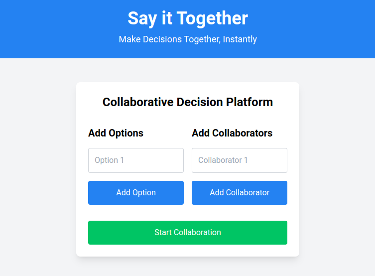

<div align="center">

  
  <h1>Say it Together</h1>
  
  <p>
    Make Decisions Together, Instantly!!
  </p>
  
  
<!-- Badges -->
<p>
  <a href="https://github.com/karanjakhar/sayittogether/graphs/contributors">
    
  </a>
  <a href="">
    
  </a>
  <a href="https://github.com/karanjakhar/sayittogether/network/members">
    
  </a>
  <a href="https://github.com/karanjakhar/sayittogether/stargazers">
    
  </a>
  <a href="https://github.com/karanjakhar/sayittogether/issues/">
    
  </a>
  <a href="https://github.com/karanjakhar/sayittogether/blob/master/LICENSE">
    
  </a>
</p>
   
<h4>
    <a href="https://github.com/karanjakhar/sayittogether/">View Demo</a>
  <span> · </span>
    <a href="https://github.com/karanjakhar/sayittogether">Documentation</a>
  <span> · </span>
    <a href="https://github.com/karanjakhar/sayittogether/issues/">Report Bug</a>
  <span> · </span>
    <a href="https://github.com/karanjakhar/sayittogether/issues/">Request Feature</a>
  </h4>
</div>

<br />

<!-- Table of Contents -->
# :notebook_with_decorative_cover: Table of Contents

- [:notebook\_with\_decorative\_cover: Table of Contents](#notebook_with_decorative_cover-table-of-contents)
  - [:star2: About the Project](#star2-about-the-project)
    - [:camera: Screenshots](#camera-screenshots)
  - [Features](#features)
  - [How It Works](#how-it-works)
    - [:space\_invader: Tech Stack](#space_invader-tech-stack)
  - [:toolbox: Getting Started](#toolbox-getting-started)
    - [:bangbang: Prerequisites](#bangbang-prerequisites)
    - [Installation](#installation)
  - [:eyes: Usage](#eyes-usage)
  - [FAQ](#faq)
  - [:wave: Contributing](#wave-contributing)
    - [:scroll: Code of Conduct](#scroll-code-of-conduct)
  - [:warning: License](#warning-license)
  - [:handshake: Contact](#handshake-contact)

  

<!-- About the Project -->
## :star2: About the Project
Create a room, share options, and make decisions with your friends in real-time. No more waiting—see everyone's choices once all selections are in. Easy, fast, and collaborative decision-making at your fingertips.

<!-- Screenshots -->
### :camera: Screenshots

<div align="center"> 
  
</div>


## Features

- **Real-Time Updates**: See results instantly without refreshing the page.
- **Easy Sharing**: Share a unique link with your friends for easy access.
- **Collaborative**: Make decisions together, no matter where you are.
- **Simple Interface**: Intuitive design for a seamless experience.

## How It Works

1. **Create a Room**: Add up to five options for your friends to choose from.
2. **Invite Friends**: Share the unique link with your friends.
3. **Make Selections**: Each friend selects their option.
4. **See Results**: Once all friends have made their selections, the results are revealed instantly.

<!-- TechStack -->
### :space_invader: Tech Stack


  <ul>
    <li><a href="https://reactjs.org/">React.js</a></li>
    <li><a href="https://tailwindcss.com/">TailwindCSS</a></li>
    <li><a href="https://firebase.google.com/">Firebase</a></li>
  </ul>


<!-- Getting Started -->
## 	:toolbox: Getting Started

<!-- Prerequisites -->
### :bangbang: Prerequisites

<ul>
    <li><a href="https://nodejs.org/en/download/package-manager">npm</a></li>
    <li><a href="https://firebase.google.com/">Firebase account</a></li>
  </ul>


### Installation

1. Clone the repository:

```sh
git clone https://github.com/yourusername/your-repo-name.git
cd your-repo-name
```

2. Install dependencies:

```sh
npm install
```

3. Set up Firebase:

- Create a Firebase project at [Firebase Console](https://console.firebase.google.com/).
- Copy the Firebase configuration and replace the placeholder in `src/firebaseConfig.js`.

```js
// src/firebaseConfig.js
const firebaseConfig = {
    apiKey: "YOUR_API_KEY",
    authDomain: "YOUR_PROJECT_ID.firebaseapp.com",
    projectId: "YOUR_PROJECT_ID",
    storageBucket: "YOUR_PROJECT_ID.appspot.com",
    messagingSenderId: "YOUR_MESSAGING_SENDER_ID",
    appId: "YOUR_APP_ID"
};
```

4. Start the development server:

```sh
npm start
```

<!-- Usage -->
## :eyes: Usage


1. **Create a Room**: Visit the home page and add options for your friends to choose from.
2. **Invite Friends**: Share the unique link with your friends.
3. **Make Selections**: Each friend can make their selection.
4. **See Results**: Results are revealed instantly once all friends have made their selections.


## FAQ

**How many options can I add?**
You can add up to five options per room.

**How do I share the room with my friends?**
After creating a room, you'll receive a unique link. Share this link with your friends to invite them to make their selections.

**Do I need to refresh the page to see the results?**
No, our platform updates in real-time. Once all friends have made their selections, the results will be revealed automatically.

**Is there a limit to the number of friends I can invite?**
No, you can invite as many friends as you like by sharing the unique link with them.


<!-- Contributing -->
## :wave: Contributing

<a href="https://github.com/karanjakhar/sayittogether/graphs/contributors">
  
</a>


Contributions are always welcome!

See `contributing.md` for ways to get started.


<!-- Code of Conduct -->
### :scroll: Code of Conduct

Please read the [Code of Conduct](https://github.com/karanjakhar/sayittogether/blob/master/CODE_OF_CONDUCT.md)


<!-- License -->
## :warning: License

Distributed under Apache2.0. See LICENSE for more information.


<!-- Contact -->
## :handshake: Contact

Karan Jakhar - [@karan-jakhar](https://www.linkedin.com/in/karan-jakhar/) - karanjakhar49@gmail.com

Project Link: [https://github.com/karanjakhar/sayittogether](https://github.com/karanjakhar/sayittogether)

